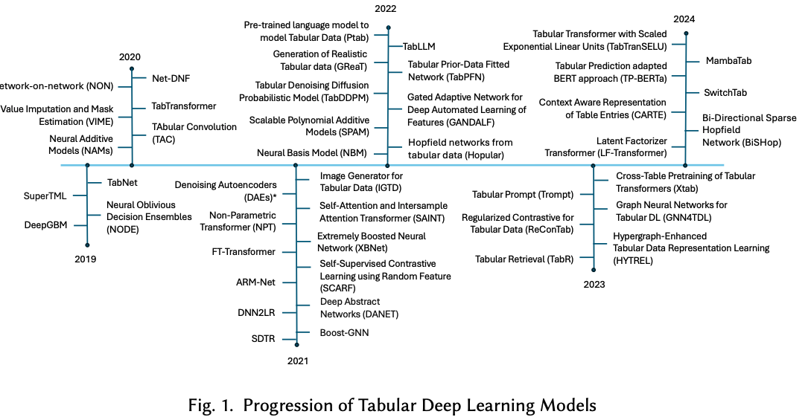

# tabular representation learning概念和背景
Tabular 数据（表格数据）是最常见的结构化数据形式，广泛存在于金融、医疗、零售、制造等领域。其承载形式主要是关系数据、online spreadsheet、csv、excel等。然而，与图像、文本、语音等领域相比，使用深度学习模型对表格数据的大规模应用起步较晚，这是由于其研究具有以下特点：

- 数据特性复杂：表格数据通常包含多种类型的特征（数值、类别、schema等），不同特征之间可能存在复杂的交互关系，传统方法难以捕捉这些特征间的深层联系。表格数据的特征分布通常是稀疏和异构的（数值型、类别型共存），同时也没有明显的空间或时间结构，深度学习模型难以直接利用其特性。
- 数据规模的制约：表格数据通常规模通常较非结构化数据更少，而深度学习模型需要大量的数据来训练，因此，表格数据表示学习在数据规模上存在一定的制约。
- 数据质量的挑战：表格数据通常需要人工整理，而人工整理的数据通常存在错误，这些错误可能会对模型的训练和预测产生负面影响。
- 传统的DNN不适应表格数据：例如CNN和MLP在表格数据上通常表现不佳，这是因为它们的参数相比表格数据来说，过度参数化（over-parameterized），缺乏归纳偏差（inductive bias）。

正是由于表格数据的这些特点，使得树模型（tree-based model，如GBDT、XGBoost、LightGBM）在表格数据上表现优秀，而深度学习模型在表格数据上整体表现不足。表示学习就是探索如何将表格数据转换为适合深度学习模型处理的形式，从而提升深度学习模型在表格数据上的表现。

# 表格数据表示学习进展
下图展示了截止到2024年，表格数据表示学习领域的进展，其中，横轴表示时间，纵轴表示代表性论文或模型 [1]。

表格表示学习可以认为是一个交叉学科/领域，主要涉及到数据库、数据分析、深度学习、图算法等领域，从发展过程整体来看，主要聚焦在这几个研究方向：
- 特征工程自动化：通过表征学习减少手工特征工程工作量，提升模型效率。
- 可解释性：在高效建模的同时，提升表征学习的可解释性，以增强信任和合规性。
- 小样本学习与迁移学习：在有限样本和领域迁移场景中，开发高效的表征学习方法。
- 异构数据融合：结合表格数据与图、文本、图像等异构数据，提升多模态分析能力。
- 在线学习：针对流式数据进行实时表征学习，提高动态系统的适应性。

如今，表格表示学习领域已经有很大程度的发展，已经慢慢成为一个独立的研究领域，例如在今年（2024年）的NeurIPS会议上，[表格表示学习（Tabular Representation Learning）](https://table-representation-learning.github.io/NeurIPS2024/)的workshop已经是第三届了; 在2024年的VLDB会议上也有[Tabular Data Analysis (TaDA)](https://tabular-data-analysis.github.io/tada2024/)的workshop，足以说明表格表示学习领域已经发展成为一个独立的研究领域。

与此同时，我注意到表格表示学习领域在最近也出现了一些非传统意义上的内容，例如一些workshop中也call for一些相关领域的论文，如 text-to-SQL(NL2SQL), table anomaly detection, 以及一些传统的数据库领域的论文，如 query optimization, data integration, data cleaning, data quality, etc. 这些内容的出现，说明表格表示学习领域正在逐渐与其他领域进行融合。

# 表格表示学习的里程碑作品
在本领域的发展中，涌现出非常多的优秀作品，这里我挑选了一些具有代表性的作品进行介绍。这些工作之所以被认为是里程碑式的工作，主要是引入了一些后来被广泛使用的架构或者方法。关于这些思路和方法我们后面回具体总结。

## TabNet (2019, Google)
TabNet 的核心思想是通过一种可学习的注意力机制，动态地选择输入特征的子集，并利用深度学习模型来捕捉复杂的特征交互，其主要创新点包括：
- 特征选择的稀疏注意力机制
TabNet 通过稀疏注意力机制（Sparse Attention Mechanism），在每个决策步骤动态地选择重要特征。这种选择机制可以让模型专注于数据中最相关的特征，从而提高效率并减少过拟合风险。
注意力机制的稀疏性是通过引入 Gumbel-Softmax 技术实现的，使得特征选择具有离散性（近似硬选择），同时保持可微性。
- 决策步骤（Decision Steps）
TabNet 的网络结构分为多个决策步骤（类似树的层次结构），每一步根据上一阶段的结果更新注意力分布，并提取出新的特征表示。
这种逐步建模的设计类似于 GBDT 的迭代过程，每一步在前一步基础上进一步优化。
- 可解释性
TabNet 可以通过注意力分布来量化每个特征的重要性，从而实现内置的模型可解释性。这种方法不仅直观，还可以对不同决策步骤的特征贡献进行分解和可视化。

# 

# 参考文献
[1] A Survey on Deep Tabular Learning, 2024, https://arxiv.org/pdf/2410.12034
[2] TabNet: Attentive Interpretable Tabular Learning, 2019, https://arxiv.org/abs/1908.07442
[3] 

[img-]